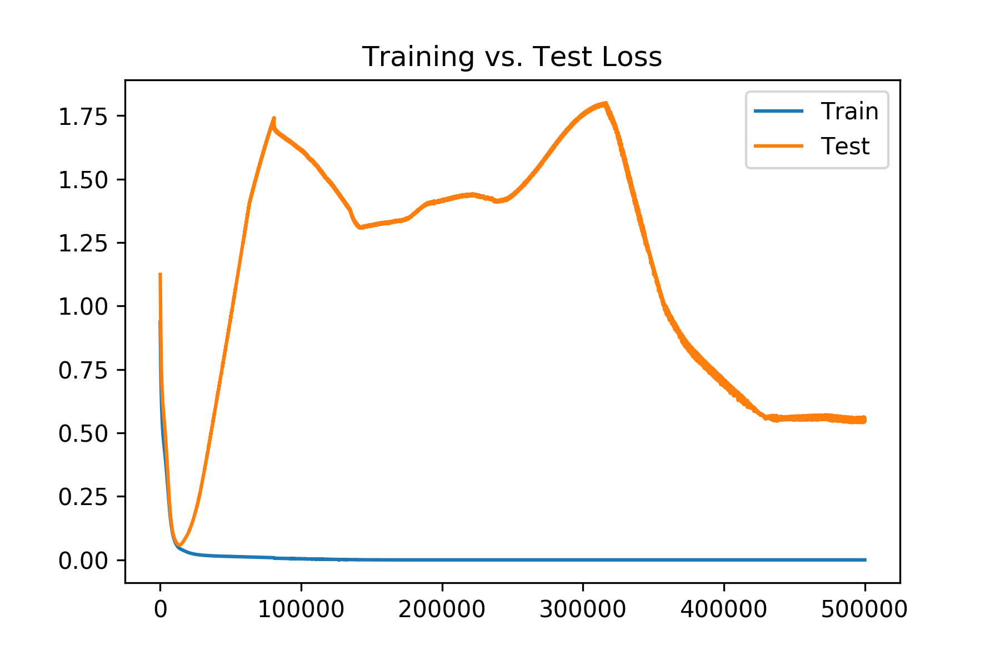
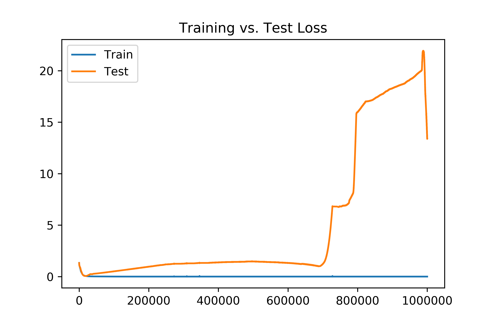

# Visualizing Neural Network Learning

The goal here is to develop some more intuition about how neural
networks learn: their dynamics and their limits. The specific
questions we ask here are inspired by certain interpretations on how
neural networks learn/generalize.

## Real Features vs. Artifacts

If we take the perspective that neurons in a neural network transmit
computations to the next layer, then reasonably, we'd want the
computation to convey something 'real' about in the data, and not some
artifact of the data. 

One possible criterion for the 'realness' of a feature is whether
there are many experiments we could perform to reveal that
feature. In other words, is there broad evidence for that feature?

We could interpret dropout technique as asking this question: if I
obscure some of the data, can the feature still be computed?
Analogously, in real life, humans understand blurry pictures or deduce
from partial information. 

Perhaps the usual neural network (MLP) structure computes this
question. Though we usually think the output of each neuron as the
result of a computation, maybe it is closer to the confidence of that
computation. Thus, each neuron represents a computation, but from the
input data, the actual computation being run by the computer, usually
something like σ(W*x + b), determines how certain the computation
would be.

Furthermore, this gives the interpretation of regularization as
preventing the model from becoming overly dependent on a small subset
of data.

This might help ensure low generalization error, as the model is then
forced to learn 'real' features.

### Experimentation

Note that this will focus mostly on MLPs, as it seems that other
techniques that build onto MLPs mostly incorporate data-dependent
optimizations (e.g. CNNs assume translation invariance).

1. How can we constrain/modify the MLP according to the above
interpretation?
2. Could we have each neuron pass a pair,
```(computation,confidence)``` instead of just ```confidence```? Or
perhaps we could work with Boolean features instead (in which case
we'd just need a ```confidence``` value).
3. Can we recode real values into binary values that incorporate
uncertainty, thus propagating uncertainty?
4. Can this be put in a more theoretical framework from the lattice of
boolean observables perspective, though perhaps relaxing to reals
through using confidence, say 𝛿∈[0,1]?

## Bifurcation of Loss: Train vs. Test

Here are two loss curves comparisions:





The x-axis is the training epoch, while the y-axis is the training and
testing loss (note the difference in scales). This was trained on a
neural network with two hidden layers: 2 dims followed by 4. Overall
(as the iris dataset has 4-dimensional input and 3-dimensional
output), the dimensions were: [4 input] -> [2 hidden] -> [4 hidden] ->
[3 output]. Training follows from Adam optimizer, with no
regularization. Learning rate is 1e-5.

The second figure shows especially how the generalization error may be
unbounded (technically, this is the cross entropy
loss). Interestingly, in both cases, the train and test loss were very
close until a 'bifurcation' point.

One possible explanation for 'what changed' at the bifurcation point
is that the model extracted most of the  generalizable information
from the training set. Quantitatively, this might mean that the
weights, W, began to grow, in the expression, W*x + b.

In reality, multiplying by large numbers increases uncertainty;
however, as there was no regularization (bounding the weights), the
learning model assumes the inputs are infinitely precise.

Possibly, the step-like loss of the second test curve suggests that
the model was learning about the training set at a level of precision
an order of magnitude greater than before. Very vaguely, it is as
though the learning model was exploring the training data as though it
were a fractal: sort of 'going deeper to the next level' of the
fractal while losing the relationship with test data.

### Experimentation

1. What qualities does this bifurcation point have?
2. Can we verify that the weights are indeed increasing as time goes
on, and that it is this that leads to the generalization error?
3. Does regularization bound the test loss? Or, can bounds on the
weights imply bounds on the generalization error?
4. For example, we might say that the number of states increase
exponentially as the weights increase. Can we prove a theoretical
number of sample sizes required to bound the generalization error?
(Plot the theoretical sample complexity? Plot the confidence intervals
on the training loss, even if just the order of magnitude?) 

## Unstructured Questions List

1. Do certain layers converge first? Perhaps earlier layers?
2. Layers as expanding/contracting uncertainty?
3. Variance of converged network? Are hidden layers comparable? Have
they extracted the same information?
4. If we bottleneck information through a layer of small dimension,
can we obtain the remaining useful information?
5. Does decreasing the batch size over time mimic increasing
discernment? 

## To Be Implemented

- Visualizing the weights matrices over training.
- Loosely, is the loss indeed a fractal? (Unclear what I mean
  here). Visualize? 