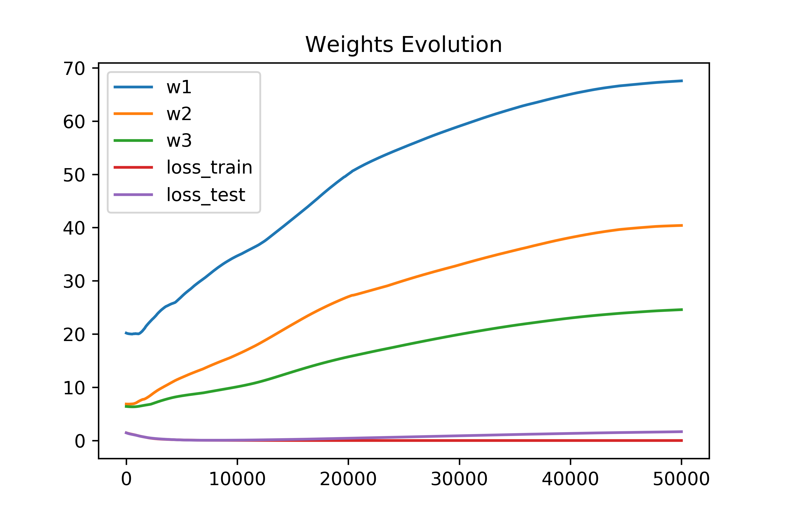

# Experiment Notes

## Increasing Weights

Here is training run on the Iris dataset (transformed into confidence
values on binary features), with no regularization, Adam optimizer,
and with model architecture [12 input] -> [6 hidden] -> [4 hidden] ->
[3 output]. Here is the loss:

Here is a l1-norm of the weights for the connections between each
layer:

