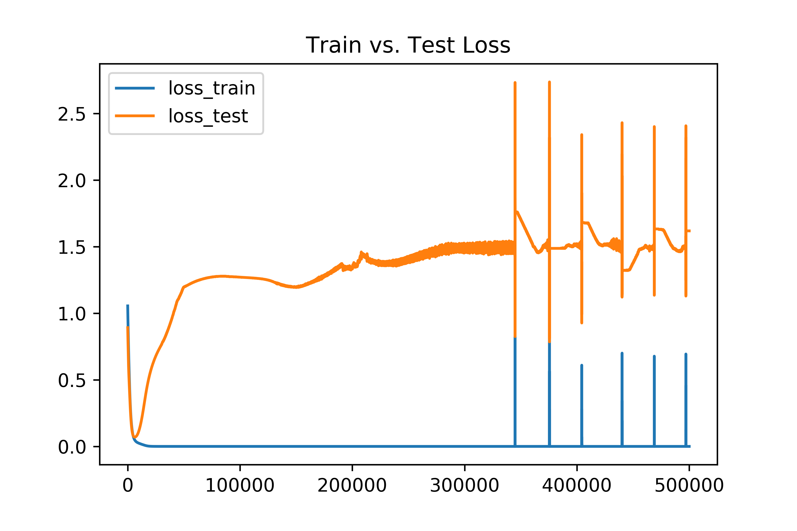
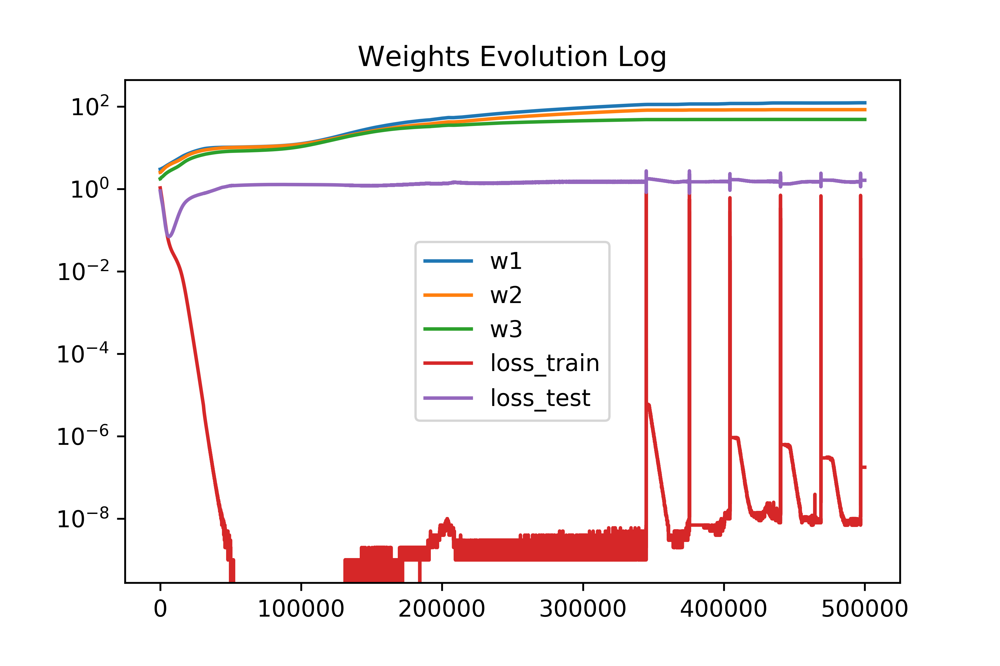

# Experiment Notes

## Increasing Weights

**Hypothesis**: generalization error (in unregularizaed MLPs) is in
 part a result of increasing weights; as the size of the weights
 increases, multiplying by these weights expands the discernability of
 input data (i.e. 'increases the precision' of the input). 

**Simple Experimental Setup:**

- Iris dataset, (a) original, (b) transformed into confidence values
  on binary features.
- MLP, no regularization, Adam optimization
- Model architecture: [n input] -> [6 hidden] -> [4 hidden] -> [3
  output], where n = 4 for the original, and n = 12 for transformed.

### Original, L1 Loss

Here is the output for the original Iris dataset (no transformation
into binary features); architecture is [4 input] -> [6 hidden] -> [4
hidden] -> [3 output].

### Original, L2 Loss

### Transformed, L2 Loss

Here is the output for the transformed dataset. Architecture is [12
input] -> [6 hidden] -> [4 hidden] -> [3 output].

### Transformed, L1 Loss

A quick run of the L1 loss:

