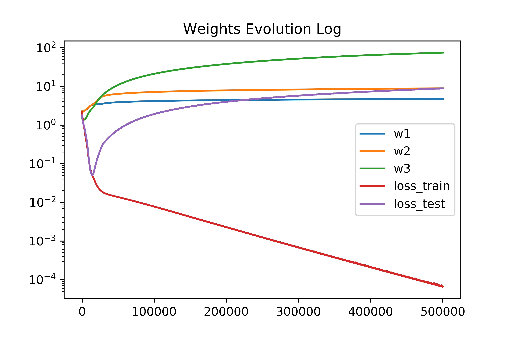

# Experiment Notes

## Increasing Weights

**Hypothesis**: generalization error (in unregularizaed MLPs) is in
 part a result of increasing weights; as the size of the weights
 increases, multiplying by these weights expands the discernability of
 input data (i.e. 'increases the precision' of the input). 

**Simple Experimental Setup:**

- Iris dataset, (a) original, (b) transformed into confidence values
  on binary features.
- MLP, no regularization, Adam optimization
- Model architecture: [n input] -> [6 hidden] -> [4 hidden] -> [3
  output], where n = 4 for the original, and n = 12 for transformed.

### Original, L1-norm of weights

Here is the output for the original Iris dataset (no transformation
into binary features); architecture is [4 input] -> [6 hidden] -> [4
hidden] -> [3 output].

### Original, L2-norm of weights

### Transformed, L1-norm of weights

Here is the output for the transformed dataset. Architecture is [12
input] -> [6 hidden] -> [4 hidden] -> [3 output].

### Transformed, L2-norm of weights

## Generalization Error vs. Weights

Here are plots comparing generalization error, |test_error -
train_error|, and the weights. Here, the generalization error is on a
logarithmic scale while the weights are on a linear scale.*

*Specifically, we applied a transformation: exp(weights/8)/2700 to get
 the scales to be comparable.

**Unfortunately, I did not properly save the *original l2* data.